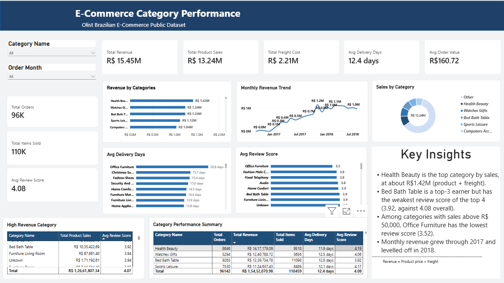

# E-Commerce Category Performance Analysis

End-to-end e-commerce analysis of a ~100,000-order dataset using SQL Server for data inspection, validation, and analysis, followed by Power BI for interactive reporting and dashboarding.

## Project Overview

This project analyzes category-level e-commerce performance across revenue, order volume, delivery time, and customer reviews. Multiple related tables were joined in SQL Server to create an analysis-ready view, which was then used to build a Power BI dashboard for business reporting.

Dataset: Brazilian E-Commerce Public Dataset by Olist (https://www.kaggle.com/datasets/olistbr/brazilian-ecommerce), covering approximately 100,000 orders from 2016–2018.

## Tools Used

- **SQL Server** — data inspection, validation, joins, transformation, and analysis
- **Microsoft Power BI** — interactive dashboard and visual reporting

## Workflow

### 1. SQL Server: Inspection, Validation & Analysis (`Project_2.sql`)

- Inspected sample records and row counts across the main tables
- Checked order statuses and delivery-date availability
- Checked for invalid or non-positive product prices
- Checked for negative freight values while retaining zero freight values
- Reviewed product category translation coverage
- Checked distinct review scores
- Investigated repeated `order_id + product_id` combinations in the raw order-item data
- Confirmed that `order_id + product_id` is not a guaranteed unique key and did not remove repeated records based on repetition alone
- Created an analysis-ready `category_performance` view by joining:
  - `raw_orders`
  - `raw_order_items`
  - `raw_products`
  - `product_category_name_translation`
  - `raw_order_reviews`
- Calculated delivery time from order purchase and delivery dates
- Used category translations with a fallback to the original category name when an English translation was unavailable
- Analyzed:
  - Revenue by category
  - Order volume
  - Average order value
  - Average delivery time
  - Average review score
  - Review coverage
  - Monthly revenue and order trends

### 2. Power BI: Analysis & Dashboard (`E-Commerce Category Performance.pbix`)

- Imported the SQL analysis-ready data into Power BI
- Built KPI cards for:
  - Total Revenue
  - Total Product Sales
  - Total Freight Cost
  - Average Delivery Days
  - Average Order Value
  - Total Orders
  - Total Items Sold
  - Average Review Score
- Added interactive filters for Category and Order Month
- Built visualizations for:
  - Revenue by Category
  - Monthly Revenue Trend
  - Sales by Category
  - Average Delivery Days
  - Average Review Score
- Added category performance tables for detailed comparison
- Added a Key Insights section to summarize major findings

## Dashboard

## Key Metrics

Metric | Value
--- | ---
Total Revenue | R$15.45M
Total Product Sales | R$13.24M
Total Freight Cost | R$2.21M
Average Order Value | R$160.72
Average Delivery Time | 12.4 days
Total Orders | 96K
Total Items Sold | 110K
Average Review Score | 4.08

## Key Insights

- **Health Beauty** is the highest-revenue category in the dashboard, generating approximately **R$1.42M** in product sales and freight.
- **Bed Bath Table** is among the highest-revenue categories while having a lower average review score than the overall displayed average.
- Among categories with product sales above **R$50,000**, **Office Furniture** has the lowest displayed average review score.
- Monthly revenue increased through much of **2017** and generally levelled off during **2018**.
- Revenue is distributed across a large number of product categories rather than being generated by only a few categories.

## Notes / Known Limitations

- `order_id + product_id` is not treated as a guaranteed unique key. Repeated combinations were investigated but not removed because repetition alone does not prove that the records are erroneous duplicates.
- The dataset does not contain cost-of-goods-sold information, so revenue and sales values should not be interpreted as profit.
- Category-level averages can be more sensitive to individual observations in categories with relatively low order volume.
- The analysis focuses on delivered orders for the category performance view.

## Project Files

File | Description
--- | ---
`E-Commerce Category Performance.pbix` | Complete Power BI analysis and interactive dashboard
`Project_2.sql` | SQL Server inspection, validation, view creation, and analysis queries
`dashboard.png` | Screenshot of the completed Power BI dashboard
`README.md` | Project documentation

## Purpose

This project was built as a data analysis portfolio piece to demonstrate SQL Server data validation and multi-table analysis, along with Power BI dashboard design and business reporting.
